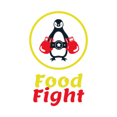

<!-- PROJECT SHIELDS -->
<!--
*** I'm using markdown "reference style" links for readability.
*** Reference links are enclosed in brackets [ ] instead of parentheses ( ).
*** See the bottom of this document for the declaration of the reference variables
*** for contributors-url, forks-url, etc. This is an optional, concise syntax you may use.
*** https://www.markdownguide.org/basic-syntax/#reference-style-links
-->
[![Contributors][contributors-shield]][contributors-url]
[![Stargazers][stars-shield]][stars-url]
[![Issues][issues-shield]][issues-url]
<!-- [![MIT License][license-shield]][license-url] -->

<!-- ? get everyones linked in links right here -->
[![Tucker's Linkedin][linkedin-shield-tucker]][linkedin-url-tucker]
[![Tyler's Linkedin][linkedin-shield-tyler]][linkedin-url-tyler]
[![Andrew's Linkedin][linkedin-shield-andrew]][linkedin-url-andrew]
[![Jared's Linkedin][linkedin-shield-jared]][linkedin-url-jared]


<!-- PROJECT LOGO -->
<br />
<p align="center">
  <a href="https://github.com/jtessensohn/food-fight">
    
  </a>

  <h3 align="center">Food Fight Web Application</h3>

  <p align="center">
    An awesome application to keep workplace/at home arguments to a minimum when it comes to deciding where to eat.
    <br />
    <a href="https://github.com/jtessensohn/food-fight"><strong>Explore the docs »</strong></a>
    <br />
    <br />
    <a href="https://github.com/jtessensohn/food-fight">View Demo</a>
    ·
    <a href="https://github.com/jtessensohn.food-fight/issues">Report Bug</a>
    ·
    <a href="https://github.com/jtessensohn.food-fight/issues">Request Feature</a>
  </p>
</p>


<!-- TABLE OF CONTENTS -->
<details open="open">
  <summary>Table of Contents</summary>
  <ol>
    <li>
      <a href="#preview-of-the-project">About The Project</a>
      <ul>
        <li><a href="#built-with">Built With</a></li>
      </ul>
    </li>
    <li><a href="#usage">Usage</a></li>
    <li><a href="#future-features">Future Features</a></li>
    <li><a href="#contact">Contact</a></li>
  </ol>
</details>


<!-- ABOUT THE PROJECT -->
## Preview of the project

[![Food Fight Screen Shot][product-screenshot]](https://example.com)

How often have you been with your peers, family, or friends and the conversation of where you are going to eat gets brought up?
I would say at least once, and I would bet that at least half of the time no one can decide on where to eat. Food fight takes the stress out of deciding where to to eat. Each person can have their input and have a chance of their choice of food getting chosen. This way, even though everyone may not be happy about it, it is at least fair.

Here's why:
* We wanted to create a solution that solves the problem any group of people have when spending time together
* People shouldn't be fighting over where everyone should be eating, let the food fight for you

Of course, this solution will not solve all of your interpersonal problems, but this is one less problem you have to worry about between you and your friends. 

### Built With

This section will list the major frameworks that we used to build our project.

* [Bootstrap](https://getbootstrap.com)
* [Bootstrap-React](https://react-bootstrap.github.io/)
* [JQuery](https://jquery.com)
* [ReactJS](https://reactjs.org/)


<br>

<br>

<br>

<br>

<br>

<br>

<br>


<br>
<br>
<br>

<!-- USAGE EXAMPLES -->
# Usage

Food-Fight is a website to help companies or groups of people decide where to eat instead of wasting time agruing with people trying to decide where to go. How it works? Easy, you sign in and create a team add what restaurants you want to pick from, drag and drop them into the fight box and just click the fight button and it picks a restaurant for you! You can also use our map function to find the closest one to you, which also gives you an address with just a click of the restaurant !

## Want to have your own Food-Fight? Click [here](https://example.com)

<br>
<!-- ROADMAP -->

# Future features
 
 ## Here's a list of idea's we have for the future of our website.
 
* Have it to where user's can vote between two restaurants.
* Have the map automatically search for the winner.
* Add where it gets all the details for the winning restaurant and displays them under the winner.

<br>

<!-- CONTACT -->
# Contact

Project Link: [https://github.com/jtessensohn/food-fight](https://github.com/jtessensohn/food-fight)

<br>


# API's

Places API  (React-Google-Maps.)

<br>

# How it works.
``` jsx
try {
            // try to send update to backend
            if (result.destination.droppableId === "fight") {
                // if it is dragged to the fight column, add competitor to fight
                await fetch(`/api/v1/fights/${fight.id}/competitors/`, {
                    method: "POST",
                    headers: {
                        'Content-Type': 'application/json'
                    },
                    body: JSON.stringify({
                        id: result.draggableId
                    })
                }).then(res => res.json())
                    .then(data => {
                        if (data.error) throw data.error
                    })
            } else if (result.destination.droppableId === "restaurants") {
                // if it is dragged to the restaurants column, remove competitor from fight
                await fetch(`/api/v1/fights/${fight.id}/competitors/${result.draggableId}`, {
                    method: "DELETE"
                }).then(res => res.json())
                    .then(data => {
                        if (data.error) throw data.error
                    })
            }
        } catch (error) {
            alert(error)
            getCurrentFight()
            return;
        }
    }
    const initiateFight = (e) => {
        fetch('/api/v1/fights/current/winner')
            .then(res => res.json())
            .then(data => {
                getCurrentFight()
            })
    }
    useEffect(() => {
        getCurrentFight()
    }, [])
```


<!-- ACKNOWLEDGEMENTS
## Acknowledgements
* [GitHub Emoji Cheat Sheet](https://www.webpagefx.com/tools/emoji-cheat-sheet)
* [Img Shields](https://shields.io)
* [Choose an Open Source License](https://choosealicense.com)
* [GitHub Pages](https://pages.github.com)
* [Animate.css](https://daneden.github.io/animate.css)
* [Loaders.css](https://connoratherton.com/loaders)
* [Slick Carousel](https://kenwheeler.github.io/slick)
* [Smooth Scroll](https://github.com/cferdinandi/smooth-scroll)
* [Sticky Kit](http://leafo.net/sticky-kit)
* [JVectorMap](http://jvectormap.com)
* [Font Awesome](https://fontawesome.com)
 -->


<!-- MARKDOWN LINKS & IMAGES -->
<!-- https://www.markdownguide.org/basic-syntax/#reference-style-links -->
[contributors-shield]: https://img.shields.io/github/contributors/jtessensohn/food-fight.svg?style=for-the-badge
[contributors-url]: https://github.com/jtessensohn/food-fight/graphs/contributors
[stars-shield]: https://img.shields.io/github/stars/jtessensohn/food-fight.svg?style=for-the-badge
[stars-url]: https://github.com/jtessensohn/food-fight/stargazers
[issues-shield]: https://img.shields.io/github/issues/jtessensohn/food-fight.svg?style=for-the-badge
[issues-url]: https://github.com/jtessensohn/food-fight/issues
<!-- [license-shield]: https://img.shields.io/github/license/jtessensohn/food-fight.svg?style=for-the-badge -->
<!-- [license-url]: https://github.com/jtessensohn/food-fight/blob/master/LICENSE.txt -->
[linkedin-shield-tucker]: https://img.shields.io/badge/-Tucker-black.svg?style=for-the-badge&logo=linkedin&colorB=555
[linkedin-url-tucker]: https://linkedin.com/in/tgsher9329

[linkedin-shield-tyler]: https://img.shields.io/badge/-Tyler-black.svg?style=for-the-badge&logo=linkedin&colorB=555
[linkedin-url-tyler]: https://www.linkedin.com/in/tylerhobbs94/

[linkedin-shield-andrew]: https://img.shields.io/badge/-Andrew-black.svg?style=for-the-badge&logo=linkedin&colorB=555
[linkedin-url-andrew]: https://www.linkedin.com/in/andrew-cochran-/

[linkedin-shield-jared]: https://img.shields.io/badge/-Jared-black.svg?style=for-the-badge&logo=linkedin&colorB=555
[linkedin-url-jared]: https://linkedin.com/in/tgsher9329

[product-screenshot]: ./client/src/images/screenshot.png
